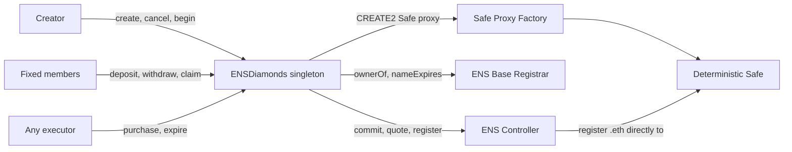
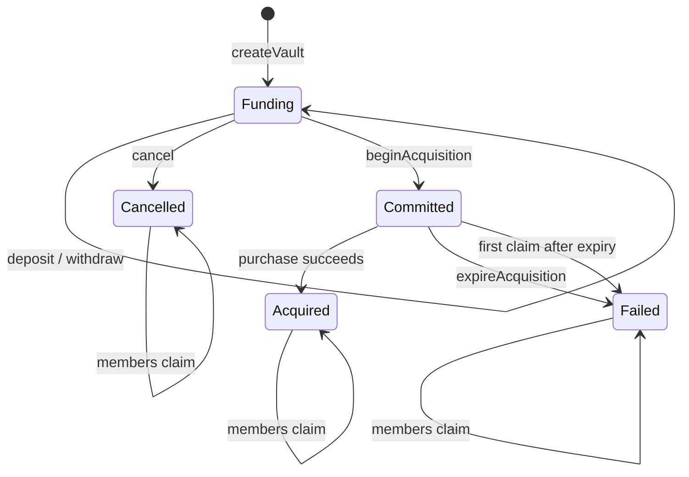
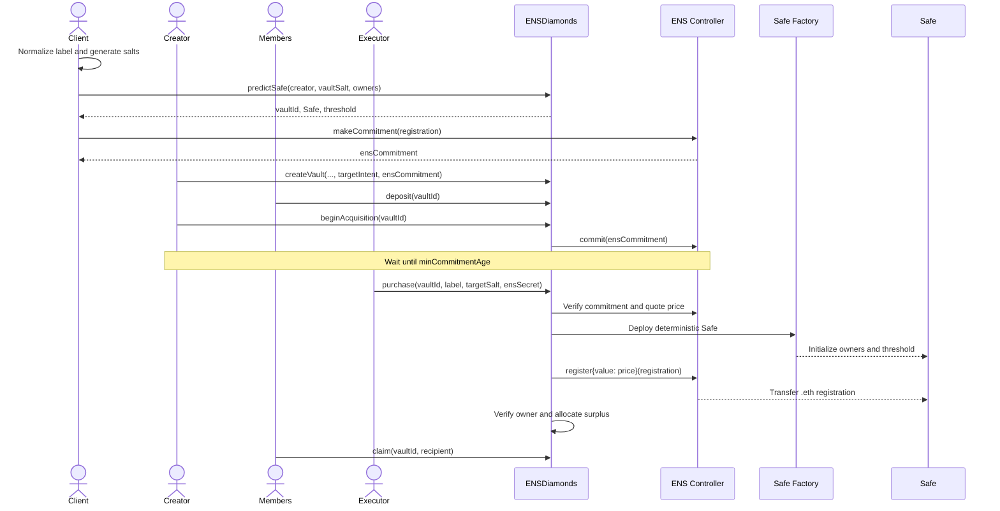
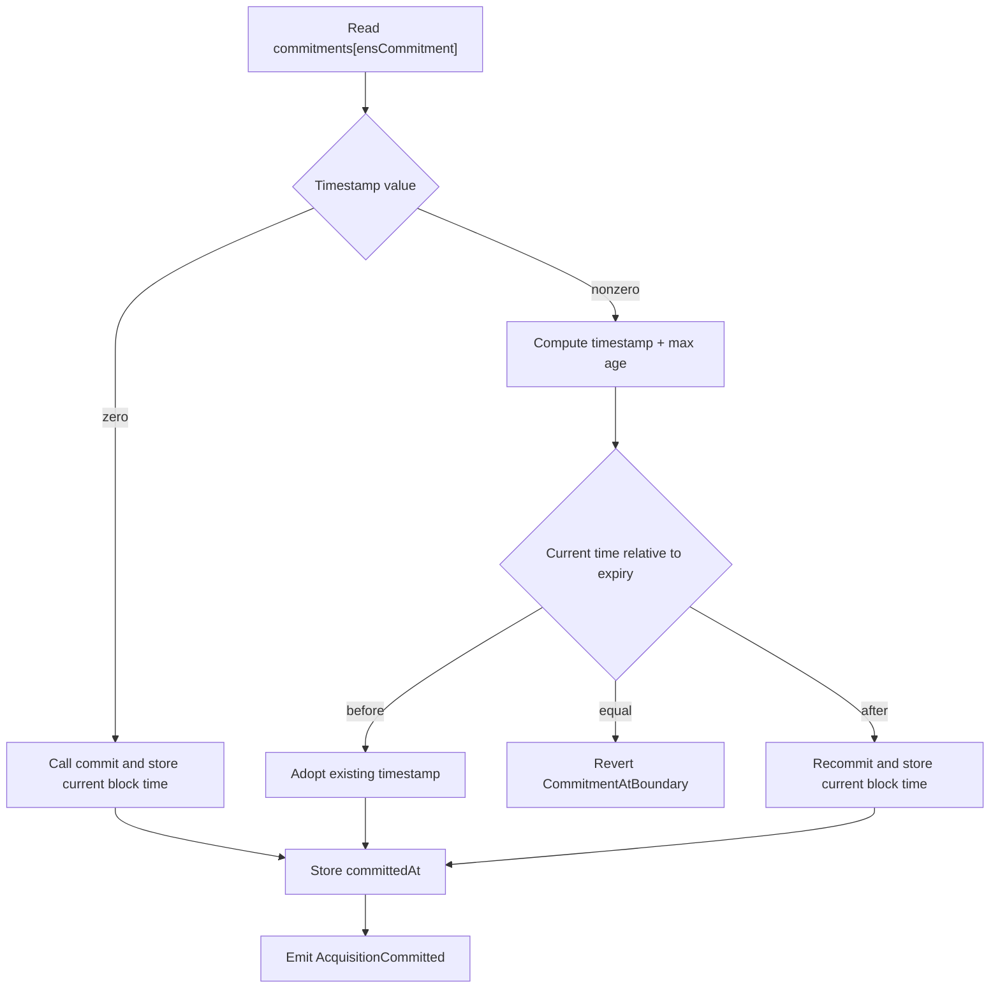
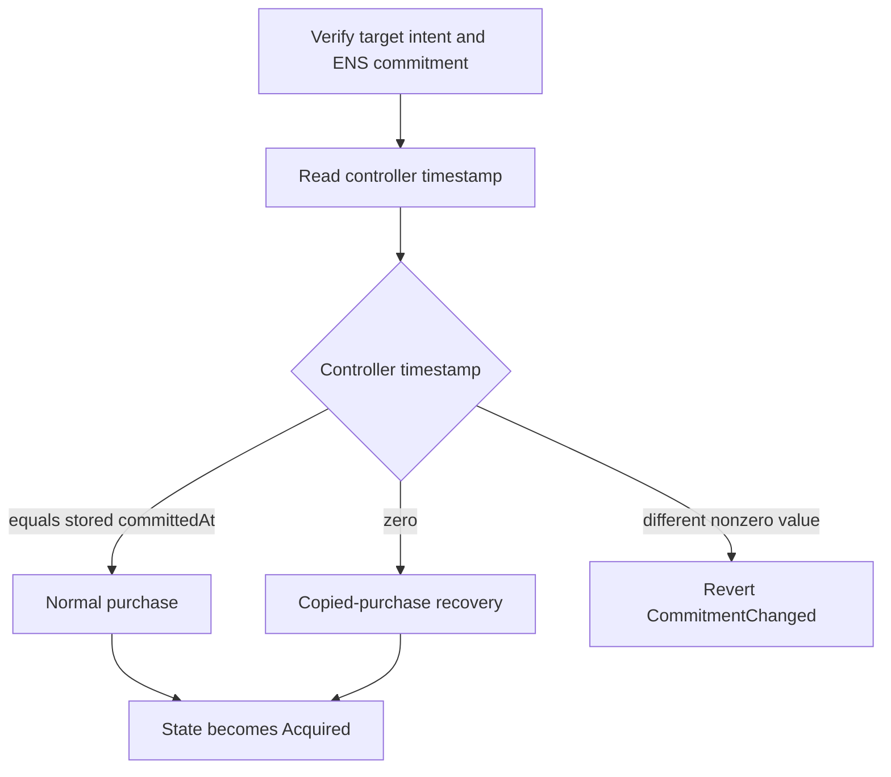
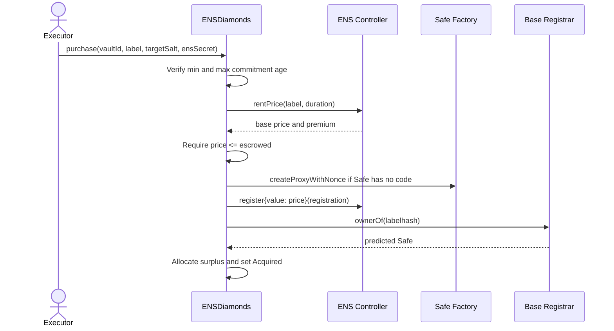
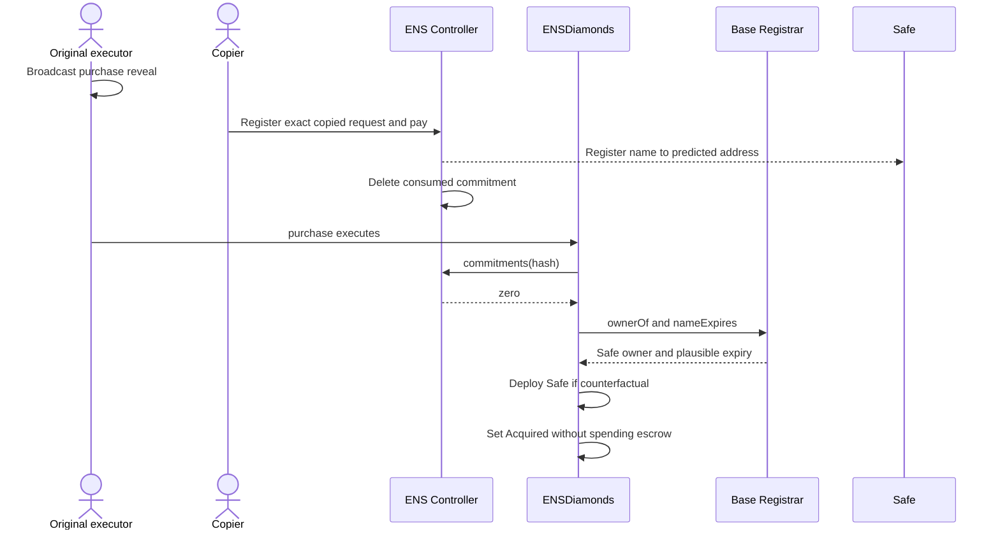
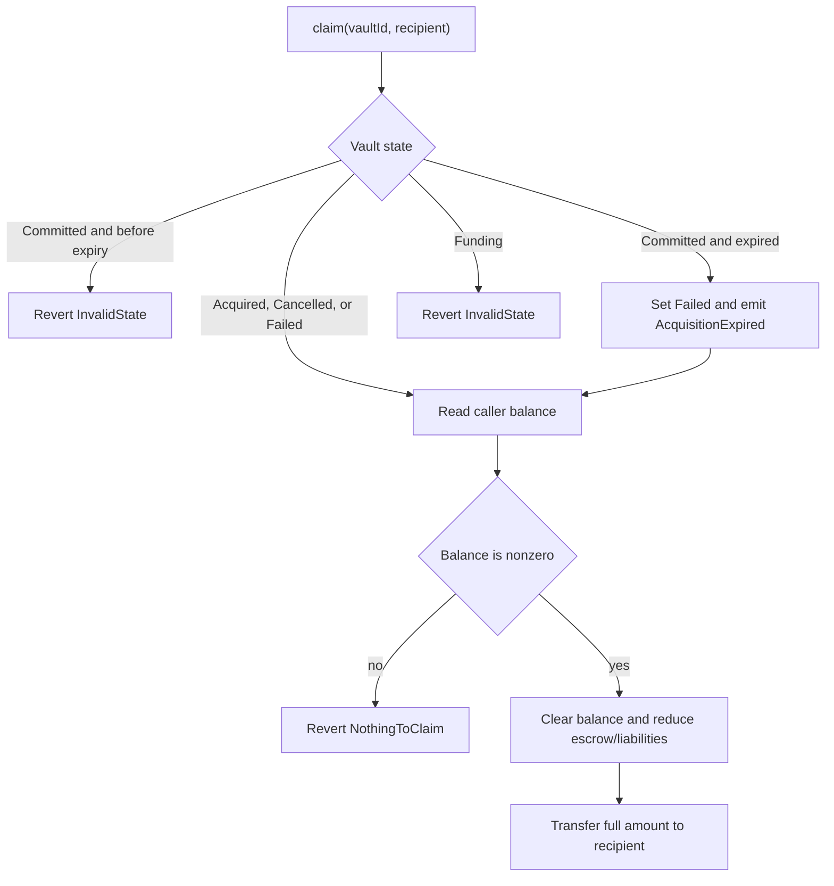

# ENS Diamonds Architecture

## 1. Protocol summary

ENS Diamonds coordinates a fixed group that pools ETH to register one second-level
`.eth` name to a deterministic Safe smart account.

Each vault fixes:

- the group members and Safe threshold;
- a maximum amount of ETH the group may escrow;
- one hidden ENS label and registration duration;
- one ENS commitment;
- one deterministic Safe address.

The group funds the vault, the creator locks funding and starts the ENS commitment
window, and then anyone may execute the purchase. The Safe is deployed only when the
name is about to be registered or when a copied registration must be recovered. ENS
Diamonds never owns the ENS name.

The implementation is one immutable singleton. It has no administrator, upgrade path,
fees, protocol token, or discretionary ETH transfer.

## 2. Scope

Version 1 supports:

- one `.eth` registration attempt per vault;
- 2 to 10 fixed Safe owners;
- a strict-majority Safe threshold;
- ETH funding by vault members;
- funding withdrawals before acquisition starts;
- creator cancellation during funding;
- deterministic Safe prediction and deployment;
- ENS commit-reveal registration;
- copied-registration recovery;
- proportional refunds of unused ETH;
- pull-based claims after acquisition, cancellation, or failure.

Version 1 does not support:

- ERC-20 funding;
- non-member deposits;
- mutable member lists;
- weighted Safe ownership;
- voting inside ENS Diamonds;
- repeated acquisition attempts in one vault;
- renewals;
- resolvers, records, reverse records, or referrers;
- subnames or NameWrapper integration;
- Safe modules or guards during setup;
- protocol fees, rewards, administration, pausing, rescue, or upgrades.

## 3. Actors and external systems

| Actor or system    | Responsibility                                                                                      |
| ------------------ | --------------------------------------------------------------------------------------------------- |
| Creator            | Defines the vault, is the first Safe owner, may cancel funding, and starts acquisition              |
| Member             | Is a fixed Safe owner; may deposit, withdraw during funding, and claim their refund                 |
| Executor           | Any address that calls permissionless purchase or expiry functions                                  |
| ENS Diamonds       | Holds escrow, validates commitments, deploys the Safe, registers the name, and accounts for refunds |
| ENS Controller     | Stores commitments, quotes rent, and registers the `.eth` name                                      |
| ENS Base Registrar | Reports the `.eth` NFT owner and registration expiry                                                |
| Safe Proxy Factory | Deploys the deterministic Safe proxy                                                                |
| Safe singleton     | Provides the Safe implementation used by every vault                                                |



## 4. Trust and deployment assumptions

The constructor receives five immutable dependencies:

```solidity
IENSDiamondsRegistrarController controller
IBaseRegistrar baseRegistrar
ISafe safeSingleton
SafeProxyFactory safeProxyFactory
address safeFallbackHandler
```

The constructor rejects a zero address or an address without code. It does not prove
that an address is the canonical deployment. Deployment tooling must provide the
correct ENS and Safe addresses for the target chain.

The contract reads and caches:

- `minCommitmentAge`;
- `maxCommitmentAge`;
- `MIN_REGISTRATION_DURATION`;
- the Safe proxy initialization-code hash.

Deployment reverts if the maximum commitment age is not greater than the minimum age,
or if the minimum registration duration cannot fit in `uint32`.

The protocol assumes:

- the configured ENS Controller follows the installed canonical behavior;
- a successful `commit()` stores the current block timestamp;
- a successful ENS registration deletes the consumed commitment;
- the configured Safe Factory and singleton implement the expected deterministic proxy
  deployment;
- clients normalize labels according to ENSIP-15 before creating commitments;
- clients generate high-entropy `targetSalt` and `ensSecret` values;
- the target chain supports EIP-1153.

Solady's transient reentrancy guard is configured to use EIP-1153 on every supported
chain, not only Ethereum mainnet.

## 5. State model

```solidity
enum State {
    Funding,
    Committed,
    Acquired,
    Cancelled,
    Failed
}
```



`Funding` is the enum's zero value. A mapping entry is considered an existing vault
only when `vault.creator != address(0)`.

The terminal states are:

- `Acquired`: the intended Safe owns the name at acquisition finalization;
- `Cancelled`: the creator stopped the vault during funding;
- `Failed`: the single commitment window expired without a finalized acquisition.

Claims do not introduce another state. Members claim independently while the vault
remains in its terminal state.

## 6. Storage model

### 6.1 Vault

```solidity
struct Vault {
    address creator;
    uint96 escrowed;
    uint96 maxSpend;
    uint40 committedAt;
    uint32 registrationDuration;
    State state;
    bytes32 targetIntent;
    bytes32 ensCommitment;
}
```

| Field                  | Meaning                                                                 |
| ---------------------- | ----------------------------------------------------------------------- |
| `creator`              | Vault creator and first Safe owner; zero means the vault does not exist |
| `escrowed`             | ETH currently owed to this vault                                        |
| `maxSpend`             | Immutable cap on total funding and therefore ENS spending               |
| `committedAt`          | ENS commitment timestamp adopted or created by `beginAcquisition`       |
| `registrationDuration` | Requested ENS registration duration in seconds                          |
| `state`                | Current lifecycle state                                                 |
| `targetIntent`         | Salted protocol commitment to the hidden target label                   |
| `ensCommitment`        | Official ENS Controller commitment                                      |

The struct occupies four storage slots:

```text
slot 0: creator (160 bits) | escrowed (96 bits)
slot 1: maxSpend (96) | committedAt (40) | registrationDuration (32) | state (8)
slot 2: targetIntent
slot 3: ensCommitment
```

`uint96` safely covers any practical ETH amount. `uint40` covers timestamps for tens of
thousands of years, and `uint32` covers registration durations of approximately 136
years.

### 6.2 Other storage

```solidity
mapping(bytes32 vaultId => Vault vault) public vaults;
mapping(bytes32 vaultId => address[] owners) internal ownersOf;
mapping(bytes32 vaultId => mapping(address member => uint256 balance)) public balanceOf;
uint256 public totalLiabilities;
```

- `ownersOf` is fixed at creation and returned through `getOwners`.
- `balanceOf` is a contribution during funding and becomes a refundable balance after
  a normal purchase.
- `totalLiabilities` tracks all ETH owed across all vaults.

## 7. Deterministic identities and commitments

### 7.1 Vault ID

The client may predict the vault ID before creation:

```solidity
vaultId = keccak256(
    abi.encode(
        keccak256("ENS_DIAMONDS_VAULT_V1"),
        block.chainid,
        address(ensDiamonds),
        creator,
        vaultSalt
    )
);
```

The ID binds the vault to:

- the protocol version domain;
- the chain;
- the ENS Diamonds deployment;
- the creator;
- the creator's public uniqueness salt.

The same creator cannot reuse the same `vaultSalt` in the same deployment because the
derived vault already exists.

### 7.2 Label hash

For a normalized single label such as `diamond`:

```solidity
labelhash = keccak256(bytes("diamond"));
```

The Base Registrar token ID is `uint256(labelhash)`. A full ENS namehash is not needed.

### 7.3 Target intent

The target intent commits to the hidden label without storing or emitting the label:

```solidity
targetIntent = keccak256(
    abi.encode(
        TARGET_INTENT_TYPEHASH,
        block.chainid,
        address(ensDiamonds),
        vaultId,
        creator,
        labelhash,
        registrationDuration,
        targetSalt
    )
);
```

The domain type is:

```text
ENSDiamondsTargetIntentV1(
    uint256 chainId,
    address protocol,
    bytes32 vaultId,
    address creator,
    bytes32 labelhash,
    uint32 registrationDuration,
    bytes32 targetSalt
)
```

`targetSalt` should be private and randomly generated. The contract does not attempt to
measure entropy; it accepts any reveal that reconstructs the stored hash.

### 7.4 ENS registration and commitment

The registration fixed by the protocol is:

```solidity
IETHRegistrarController.Registration({
    label: normalizedLabel,
    owner: predictedSafe,
    duration: registrationDuration,
    secret: ensSecret,
    resolver: address(0),
    data: new bytes[](0),
    reverseRecord: 0,
    referrer: bytes32(0)
});
```

Clients should obtain the commitment through the configured controller's
`makeCommitment(registration)` function. The commitment binds every registration field,
including the predicted Safe owner.

`ensSecret` should be independent from the label, vault salt, target salt, vault ID,
and public timestamps.

### 7.5 Safe address

The Safe threshold is:

```solidity
threshold = owners.length / 2 + 1;
```

| Owners | Threshold |
| -----: | --------: |
|      2 |         2 |
|      3 |         2 |
|      4 |         3 |
|      5 |         3 |
|     10 |         6 |

The salt nonce binds the Safe to the protocol, chain, deployment, and vault:

```solidity
saltNonce = uint256(
    keccak256(
        abi.encode(
            keccak256("ENS_DIAMONDS_SAFE_V1"),
            block.chainid,
            address(ensDiamonds),
            vaultId
        )
    )
);
```

The Safe initializer configures:

- the fixed owners in their stored order;
- the strict-majority threshold;
- no setup delegatecall;
- the immutable compatibility fallback handler;
- no payment token, payment, module, or guard.

The Safe Factory CREATE2 formula binds the factory, singleton, initializer, and salt
nonce. `predictSafe` and deployment use the same calculation.

## 8. End-to-end user flow



### Client preparation

Before `createVault`, the client must:

1. Normalize the label according to ENSIP-15.
2. Choose 2 to 10 unique owners with the creator at index zero.
3. Generate a nonzero public `vaultSalt`.
4. Generate private high-entropy `targetSalt` and `ensSecret` values.
5. Call `predictSafe` to obtain the deterministic `vaultId` and Safe.
6. Calculate `labelhash` and `targetIntent`.
7. Build the exact ENS registration with the predicted Safe as owner.
8. Call the configured ENS Controller's `makeCommitment`.
9. Keep the label, `targetSalt`, and `ensSecret` private until purchase.

## 9. Function-by-function flow

### 9.1 `predictSafe`

```solidity
function predictSafe(
    address creator,
    bytes32 vaultSalt,
    address[] calldata owners
) external view returns (
    bytes32 vaultId,
    address safe,
    uint256 threshold
);
```

Purpose: validate an intended owner roster and return the deterministic vault and Safe
addresses before any state is created.

Checks:

- creator is not zero;
- vault salt is not zero;
- owner count is between 2 and 10;
- `owners[0] == creator`;
- owners are unique;
- no owner is zero, the Safe linked-list sentinel, or ENS Diamonds;
- the predicted Safe is not one of its own owners.

State changes: none.

External calls: none.

### 9.2 `createVault`

```solidity
function createVault(
    bytes32 vaultSalt,
    uint96 maxSpend,
    uint32 registrationDuration,
    address[] calldata owners,
    bytes32 targetIntent,
    bytes32 ensCommitment
) external payable returns (bytes32 vaultId);
```

Caller: creator.

Initial state: a new vault is created in `Funding`.

Checks:

- vault salt, maximum spend, target intent, and ENS commitment are nonzero;
- registration duration is at least the controller minimum;
- optional `msg.value` does not exceed `maxSpend`;
- owner validation is identical to `predictSafe`;
- the derived vault ID does not already exist;
- the predicted Safe is not in the owner list.

Effects:

- stores the packed vault;
- stores the fixed owner roster;
- records `msg.value` as the creator's first contribution when nonzero;
- increases `totalLiabilities` by `msg.value`.

Event:

```solidity
VaultCreated(
    vaultId,
    creator,
    maxSpend,
    registrationDuration,
    owners,
    targetIntent,
    ensCommitment,
    creatorDeposit
);
```

The name and secrets are not revealed.

### 9.3 `deposit`

```solidity
function deposit(bytes32 vaultId) external payable;
```

Caller: any fixed member.

Required state: `Funding`.

Checks:

- `msg.value > 0`;
- caller is in the fixed owner roster;
- updated escrow does not exceed `maxSpend`.

Effects:

```text
balanceOf[vaultId][caller] += msg.value
vault.escrowed             += msg.value
totalLiabilities           += msg.value
```

Event: `Deposited(vaultId, member, amount)`.

### 9.4 `withdraw`

```solidity
function withdraw(
    bytes32 vaultId,
    uint256 amount,
    address payable recipient
) external;
```

Caller: a contributor withdrawing their own recorded balance.

Required state: `Funding`.

Checks:

- amount is nonzero;
- recipient is nonzero;
- amount does not exceed the caller's balance.

Effects are applied before the ETH transfer:

```text
caller balance    -= amount
vault escrow      -= amount
total liabilities -= amount
```

The transfer uses Solady `SafeTransferLib`. A failed transfer reverts all accounting
changes.

Event: `Withdrawn(vaultId, member, recipient, amount)`.

### 9.5 `cancel`

```solidity
function cancel(bytes32 vaultId) external;
```

Caller: creator only.

Required state: `Funding`.

Effects:

```text
Funding -> Cancelled
```

Balances, escrow, and liabilities remain unchanged. Members recover their complete
contributions through `claim`.

Event: `VaultCancelled(vaultId)`.

### 9.6 `beginAcquisition`

```solidity
function beginAcquisition(bytes32 vaultId) external;
```

Caller: creator only.

Required state: `Funding`.

Additional requirement: `vault.escrowed > 0`.

The function first changes the state to `Committed`, preventing further deposits,
withdrawals, or cancellation during external ENS calls. A downstream revert rolls the
state change back.



An ENS commitment is permissionless and the hash is public. Adopting an existing
unexpired commitment prevents another account from blocking the vault by submitting
the same hash first.

The exact maximum-age boundary is unusable:

- ENS registration requires `now < committedAt + maxAge`;
- ENS recommitment requires `now > committedAt + maxAge`.

At equality, the creator must retry in a later block.

The Safe remains counterfactual. This function only calculates its address for the
event.

Event:

```solidity
AcquisitionCommitted(
    vaultId,
    ensCommitment,
    predictedSafe,
    committedAt,
    threshold
);
```

### 9.7 `purchase`

```solidity
function purchase(
    bytes32 vaultId,
    string calldata normalizedLabel,
    bytes32 targetSalt,
    bytes32 ensSecret
) external;
```

Caller: permissionless.

Required state: `Committed`.

The caller supplies no ETH. The vault pays the ENS price.

The function:

1. Hashes the revealed normalized label.
2. Reconstructs and verifies the stored target intent.
3. Recalculates the deterministic Safe and threshold.
4. Builds the exact ENS registration with the Safe as owner.
5. Calls `makeCommitment` and verifies the stored ENS commitment.
6. Reads the controller's current timestamp for that commitment.
7. Selects normal purchase, copied-purchase recovery, or failure.

Permissionless execution is safe because the two stored commitments bind every
caller-supplied field that can affect the registration.



#### Normal purchase

The controller timestamp equals the vault's stored timestamp, meaning the commitment
is still active and unchanged.



Time checks:

```text
validAt   = committedAt + MIN_COMMITMENT_AGE
expiresAt = committedAt + MAX_COMMITMENT_AGE

now < validAt    -> CommitmentTooYoung
now >= expiresAt -> CommitmentExpired
otherwise         -> purchase window is valid
```

Price and deployment:

- the price is `quote.base + quote.premium`;
- price must not exceed current escrow;
- current escrow cannot exceed `maxSpend`, so the spend cap is enforced;
- the Safe is deployed only after time and funding checks pass;
- an already deployed predicted Safe is adopted.

Postcondition:

```solidity
BASE_REGISTRAR.ownerOf(uint256(labelhash)) == predictedSafe
```

A successful controller call is insufficient without this owner check.

Settlement:

```text
surplus = funding - price
member refund = floor(member contribution * surplus / funding)
```

The final rounding remainder is assigned to the last positive contributor. Original
contribution balances are replaced with refund balances. The vault escrow becomes the
surplus, state becomes `Acquired`, and `totalLiabilities` decreases by the ENS price.

Event:

```solidity
NameAcquired(
    vaultId,
    labelhash,
    predictedSafe,
    price,
    surplus,
    false
);
```

#### Copied-purchase recovery

The canonical ENS Controller deletes a commitment after successful registration. If
the current commitment timestamp is zero, someone may have copied the revealed
purchase and registered first.

The same commitment cannot register to an attacker-selected owner: the predicted Safe
is part of the committed registration.



Recovery requires:

- the original commitment window has not expired;
- the predicted Safe currently owns the name;
- the name is currently unexpired;
- the name expiry is at least
  `committedAt + minCommitmentAge + registrationDuration`;
- the name expiry is less than
  `committedAt + maxCommitmentAge + registrationDuration`.

The Safe is then deployed if the copied registration sent the NFT to its
counterfactual address.

ENS Diamonds paid no registration price, so member balances, escrow, and global
liabilities remain unchanged.

Event:

```solidity
NameAcquired(
    vaultId,
    labelhash,
    predictedSafe,
    0,
    vault.escrowed,
    true
);
```

### 9.8 `expireAcquisition`

```solidity
function expireAcquisition(bytes32 vaultId) external;
```

Caller: permissionless.

Required state: `Committed`.

The function calculates:

```solidity
expiresAt = committedAt + MAX_COMMITMENT_AGE;
```

Before `expiresAt`, it reverts with `CommitmentNotExpired`. At or after `expiresAt`, it
changes:

```text
Committed -> Failed
```

No balances or liabilities change. The separate function lets a keeper or frontend
materialize the failed state without claiming funds.

Event: `AcquisitionExpired(vaultId)`.

### 9.9 `claim`

```solidity
function claim(
    bytes32 vaultId,
    address payable recipient
) external;
```

Caller: any member claiming only `balanceOf[vaultId][msg.sender]`.

Allowed states:

- `Acquired`;
- `Cancelled`;
- `Failed`;
- an expired `Committed` vault, which is changed to `Failed` first.



Refund meaning by state:

| State                       | Claimable balance                                     |
| --------------------------- | ----------------------------------------------------- |
| `Cancelled`                 | Original unwithdrawn contribution                     |
| `Failed`                    | Original unwithdrawn contribution                     |
| `Acquired`, normal purchase | Proportional share of unused escrow                   |
| `Acquired`, copied purchase | Original contribution because ENS Diamonds spent zero |

The function always claims the caller's complete balance. The recipient may differ
from the caller, but the caller cannot claim another member's balance.

Accounting is cleared before ETH transfer. A transfer failure reverts the entire claim,
restoring the balance, escrow, and liabilities.

Event: `Claimed(vaultId, member, recipient, amount)`.

### 9.10 `getOwners` and public getters

```solidity
function getOwners(bytes32 vaultId)
    external
    view
    returns (address[] memory);
```

`getOwners` validates that the vault exists and returns the complete fixed roster.

The contract also exposes:

- `vaults(vaultId)`;
- `balanceOf(vaultId, member)`;
- `totalLiabilities()`;
- `CONTROLLER()` and `BASE_REGISTRAR()`;
- `SAFE_SINGLETON()`, `SAFE_PROXY_FACTORY()`, and `SAFE_FALLBACK_HANDLER()`;
- `SAFE_PROXY_INIT_CODE_HASH()`;
- `MIN_MEMBERS()`, `MAX_MEMBERS()`, and `TARGET_INTENT_TYPEHASH()`.

### 9.11 Error surface

| Error                                  | Meaning                                                               |
| -------------------------------------- | --------------------------------------------------------------------- |
| `InvalidContract(dependency)`          | Constructor dependency is zero or has no code                         |
| `InvalidConfiguration()`               | Constructor, vault, duration, or prediction configuration is invalid  |
| `InvalidAddress()`                     | A required account or ETH recipient is zero                           |
| `InvalidOwners()`                      | Safe owner count, ordering, uniqueness, or address rules are violated |
| `InvalidAmount()`                      | Deposit or withdrawal is zero, or acquisition has no escrow           |
| `VaultNotFound()`                      | `vaultId` has no nonzero creator                                      |
| `VaultAlreadyExists()`                 | The derived vault ID is already in use                                |
| `Unauthorized()`                       | A non-creator attempted a creator-only transition                     |
| `InvalidState(current)`                | The function is unavailable in the current vault state                |
| `NotMember()`                          | A non-member attempted to deposit                                     |
| `FundingLimitExceeded()`               | Creation or deposit would exceed `maxSpend`                           |
| `InsufficientBalance()`                | Withdrawal exceeds the caller's funding balance                       |
| `TargetMismatch()`                     | Revealed label context does not reconstruct `targetIntent`            |
| `CommitmentMismatch()`                 | Revealed ENS registration does not reconstruct `ensCommitment`        |
| `CommitmentAtBoundary()`               | ENS permits neither use nor replacement at the exact max-age boundary |
| `CommitmentTooYoung(validAt)`          | Purchase was attempted before the minimum age                         |
| `CommitmentExpired(expiredAt)`         | Purchase or copied recovery was attempted after expiry                |
| `CommitmentNotExpired(expiresAt)`      | Explicit expiry was attempted too early                               |
| `CommitmentChanged()`                  | Controller has an unexpected nonzero commitment timestamp             |
| `InsufficientFunding(price, escrowed)` | Current ENS price exceeds vault escrow                                |
| `SafeVerificationFailed()`             | Safe deployment did not produce the predicted contract                |
| `ENSVerificationFailed()`              | ENS owner, expiry, or Base Registrar read failed verification         |
| `NothingToClaim()`                     | Caller has no refundable balance                                      |
| `ETHTransferFailed()`                  | Withdrawal or claim recipient rejected ETH                            |
| `DirectETHNotAccepted()`               | ETH or unknown calldata was sent outside a protocol function          |
| `Reentrancy()`                         | Solady transient reentrancy guard rejected a nested call              |

## 10. Accounting

For every vault:

```text
sum of member balances == vault.escrowed
```

This remains true when:

- deposits add contributions;
- withdrawals remove contributions;
- cancellation or failure changes only state;
- normal settlement replaces contributions with surplus shares;
- copied recovery leaves contributions unchanged;
- claims clear one balance and reduce escrow by the same amount.

Globally:

```text
sum of vault escrow == totalLiabilities
```

After completed transactions:

```text
address(ENSDiamonds).balance >= totalLiabilities
```

Forced ETH may make the contract balance larger than liabilities. Direct calls to
`receive` and `fallback` revert, and there is no rescue function, so forced surplus is
not assigned to any vault.

| Action                       | Vault escrow |            Member balances | Total liabilities |
| ---------------------------- | -----------: | -------------------------: | ----------------: |
| Create or deposit `x` ETH    |         `+x` |                caller `+x` |              `+x` |
| Withdraw `x` ETH             |         `-x` |                caller `-x` |              `-x` |
| Cancel or expire             |    unchanged |                  unchanged |         unchanged |
| Normal purchase at price `p` |         `-p` | replaced by surplus shares |              `-p` |
| Copied purchase              |    unchanged |                  unchanged |         unchanged |
| Claim `x` ETH                |         `-x` |             caller cleared |              `-x` |

## 11. Failure and adversarial cases

### Same commitment copied

A copier can use a revealed registration first, but the same commitment fixes the
predicted Safe as owner. Recovery succeeds only if the Safe owns the name and the
expiry is plausible. The copier pays; all vault ETH remains refundable.

### Different commitment snipes the name

An attacker can commit to the same label with a different owner and secret. That does
not delete the vault's commitment. ENS Diamonds enters the normal branch, and ENS
registration reverts because the name is unavailable. After the vault commitment
expires, the attempt becomes `Failed` and members claim refunds.

### Name transferred away after a copied purchase

Using the exact commitment initially registers to the predicted Safe. Safe owners may
later transfer the name through Safe governance. If the Safe no longer owns the name
when recovery runs, `ENSVerificationFailed` is raised. The vault remains `Committed`
until expiry, then fails and refunds.

### Commitment expires while the name remains available

Commitment expiry does not register or reserve the name. It only makes the current
commitment unusable. The vault moves to `Failed`; it cannot recommit. Members must claim
and create a new vault for another attempt.

### ENS price exceeds escrow

`purchase` reverts with `InsufficientFunding`. Funding is already locked, so the group
cannot add ETH. If no purchase succeeds before expiry, the vault fails and refunds.

### Recipient rejects ETH

`withdraw` or `claim` reverts atomically. The caller may retry with another recipient.

### Safe already exists

If code exists at the predicted address, deployment is skipped. The CREATE2 address is
bound to the configured factory, singleton, initializer, and salt. The initial owners
may have already used the Safe; ENS Diamonds does not restrict later Safe governance.

## 12. Security properties

- Vault existence is checked through a nonzero creator, not the default enum value.
- Funding cannot exceed the immutable `maxSpend`.
- Only fixed members can deposit.
- Members can withdraw only their own funding balance.
- Only the creator can cancel or begin acquisition.
- Purchase and expiry are permissionless but fully constrained by stored commitments
  and timestamps.
- The label, duration, chain, deployment, creator, and vault are bound by the target
  intent.
- Every ENS registration field is bound by the official ENS commitment.
- The ENS name is registered directly to the deterministic Safe.
- Normal purchase verifies final Base Registrar ownership.
- Copied recovery verifies current ownership and a bounded expiry.
- External ETH transfers use checks-effects-interactions and a transient reentrancy
  guard.
- Contribution loops contain no external calls and are bounded by 10 members.
- Pull-based claims prevent one recipient from blocking another member.
- Constructor dependencies are immutable.
- There is no owner, administrator, arbitrary call target, delegatecall, upgrade, pause,
  or rescue mechanism.

## 13. Architecture decisions

### Singleton escrow instead of one vault contract per group

All vaults share one immutable ENS Diamonds implementation and are isolated by
`vaultId` mappings.

Benefits:

- no factory or per-vault deployment cost;
- one audited runtime implementation;
- simpler discovery and indexing;
- shared immutable ENS and Safe configuration;
- explicit global liability accounting.

Trade-off:

- ETH for all vaults is held at one address, so accounting invariants are critical.

A separate Safe is still created for every vault because the Safe, not ENS Diamonds,
owns the acquired name.

### Two phases: funding and acquisition

`createVault` immediately opens `Funding`. Members may deposit and withdraw until the
creator calls `beginAcquisition`.

The separate transition is required because acquisition locks balances for the ENS
commitment window. Merging creation and commitment would remove the period in which
other members can fund or exit.

### Fixed roster and strict-majority Safe

Owners are immutable inside ENS Diamonds and limited to 2 through 10. The creator must
be first. Safe ownership is equal, with threshold `floor(n / 2) + 1`.

ENS Diamonds contains no voting mechanism. After deployment, the Safe owners govern
the Safe using normal Safe transactions and may change its configuration.

### Deterministic Safe with delayed deployment

The Safe address is known before vault creation and is embedded in the ENS commitment.
Deployment is delayed until purchase or copied recovery.

This avoids deployment cost for cancelled or failed vaults while allowing ENS to
register directly to the final owner.

### One acquisition attempt per vault

An expired `Committed` vault becomes `Failed` and cannot recommit.

This prevents the creator from repeatedly relocking member funds after contributors
expect refunds. Supporting retries would require explicit consent, claim coordination,
and rules for partially withdrawn escrow.

A new attempt requires a new vault. Because the vault ID contributes to Safe
derivation, the new vault has a new predicted Safe.

### Permissionless execution

Only the creator controls cancellation and the transition out of funding. Once
committed, anyone may execute `purchase` or `expireAcquisition`.

The purchase caller has no discretion over the name, Safe owner, duration, resolver
configuration, or maximum spend; stored commitments and escrow enforce all of them.
Permissionless execution removes creator liveness from the purchase step.

### Immutable maximum spend

`maxSpend` caps total escrow. Purchase requires `price <= escrowed`, and escrow can
never exceed `maxSpend`, so there is no separate purchase-time spending parameter that
an executor could manipulate.

### Hidden target with two commitments

The protocol target intent binds ENS Diamonds-specific context and hides the label with
`targetSalt`. The ENS commitment separately binds the exact registration and
`ensSecret`.

Two commitments are retained because they protect different domains:

- target intent binds chain, protocol, vault, creator, label, and duration;
- ENS commitment is the value recognized and consumed by the ENS Controller.

Normalization and secret entropy remain client responsibilities because they are not
practical to validate on-chain.

### Adopt existing commitments

Anyone can submit a public ENS commitment hash. `beginAcquisition` adopts an existing
unexpired commitment with the same hash instead of reverting, preventing a third party
from blocking acquisition by committing first.

### Copied-purchase recovery

Revealing the ENS secret in a public transaction allows another account to copy the
exact registration and pay first. Because the commitment fixes the Safe as owner, this
cannot redirect the name.

Recovery recognizes the valid end state, verifies ownership and expiry, marks the vault
acquired, and preserves all escrow for refunds.

### Pull-based refunds

Cancellation, failure, and acquisition do not send ETH in a member loop. Each member
claims independently.

This bounds external-call risk, prevents a reverting recipient from blocking the
vault, and keeps purchase gas predictable.

### Proportional surplus

The normal purchase consumes a common price from pooled funding. Unused ETH is returned
in proportion to contribution, not split equally by Safe ownership.

Safe control and economic contribution are intentionally separate:

- every owner receives equal Safe authority;
- refunds follow contributed ETH.

### Cached ENS timing

The commitment ages and minimum duration are read once during deployment and stored as
internal immutables. This removes repeated external calls and fixes the timing rules for
the protocol deployment.

The controller remains publicly readable for clients that need to display those values.

### Narrow integration interfaces

The local `IBaseRegistrar` contains only `ownerOf` and `nameExpires`, avoiding the
unused ERC-721 interface tree. `IENSDiamondsRegistrarController` extends the installed
ENS interface only with public getters missing upstream.

This keeps production source and reachable dependencies limited to the surfaces the
protocol uses.

### No administration or rescue path

The protocol cannot be paused, upgraded, reconfigured, or drained by a privileged
account. This reduces governance and key-management risk.

The trade-off is that dependency mistakes cannot be corrected, forced ETH cannot be
recovered, and a new deployment is required for protocol changes.

## 14. Integration checklist

A client integrating ENS Diamonds should:

1. Read the configured dependency addresses and chain ID.
2. Normalize the label with an ENSIP-15 implementation.
3. Generate independent salts and store private values securely.
4. Call `predictSafe` before constructing either commitment.
5. Put the creator at `owners[0]` and preserve owner ordering.
6. Use the exact registration fields documented above.
7. Obtain the ENS commitment from the configured controller.
8. Display `maxSpend`, current escrow, individual balance, state, and commitment
   deadlines.
9. Wait until `committedAt + minCommitmentAge` before purchase.
10. Treat `committedAt + maxCommitmentAge` as an exclusive purchase deadline.
11. Allow any account or keeper to submit purchase.
12. After a terminal state, call `claim` separately for each member.

Indexers should use:

- `VaultCreated` to discover vaults and owner rosters;
- `Deposited` and `Withdrawn` for funding activity;
- `AcquisitionCommitted` for the commitment window and predicted Safe;
- `NameAcquired` for normal versus copied acquisition;
- `AcquisitionExpired` for failure;
- `Claimed` for refund completion.
