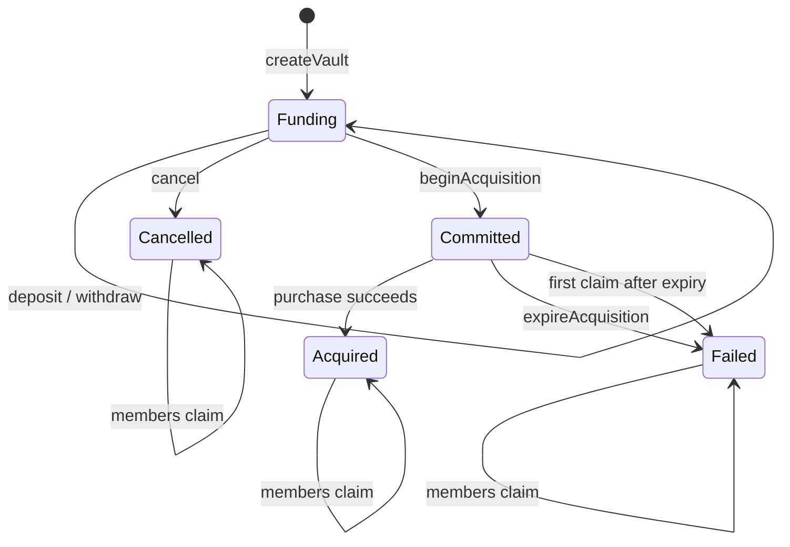
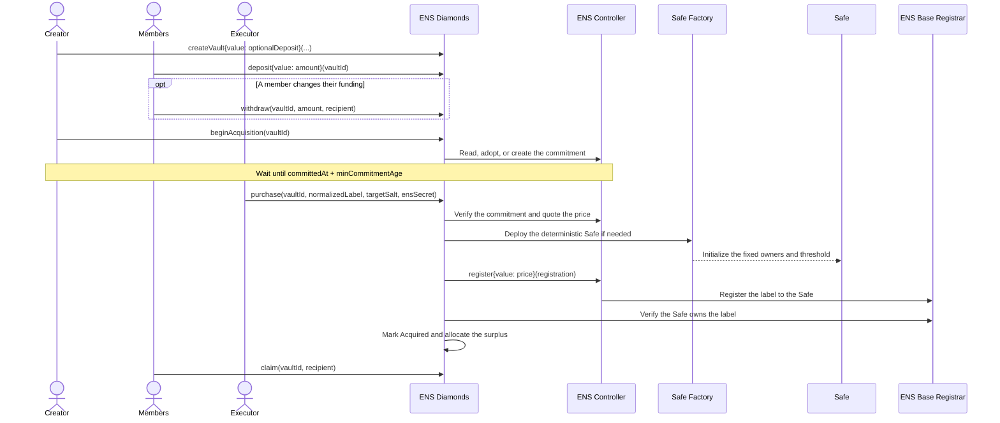
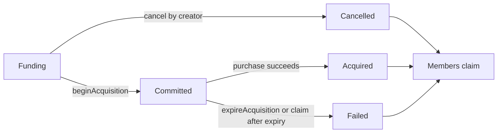
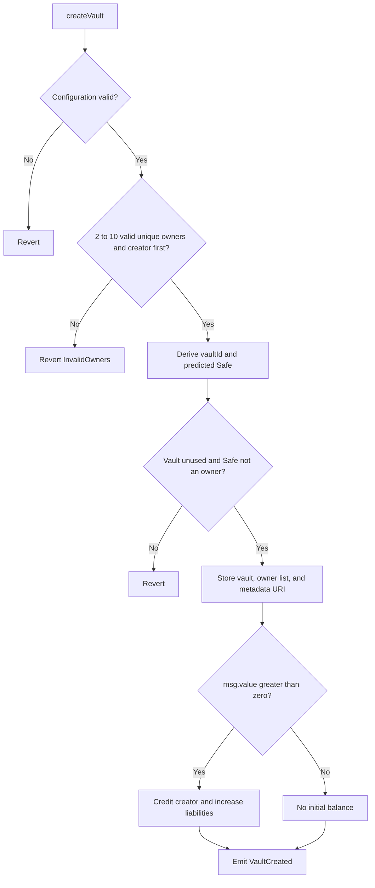
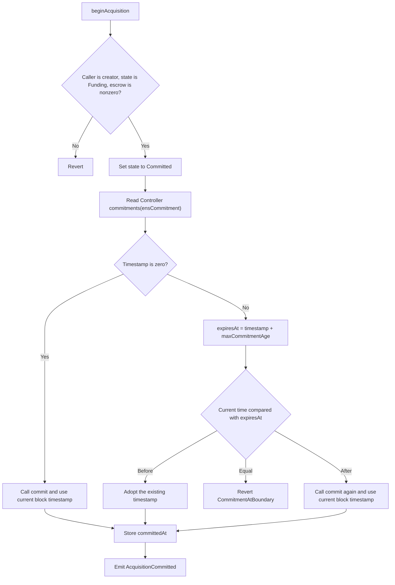
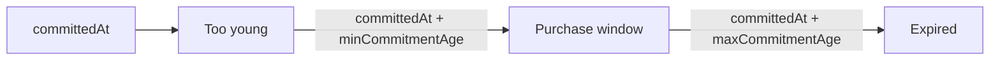
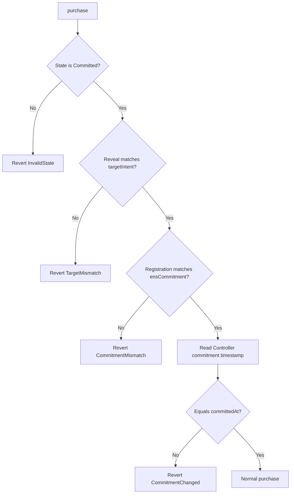
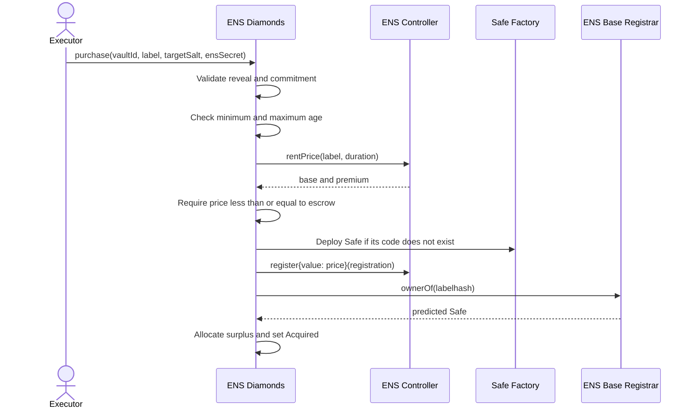
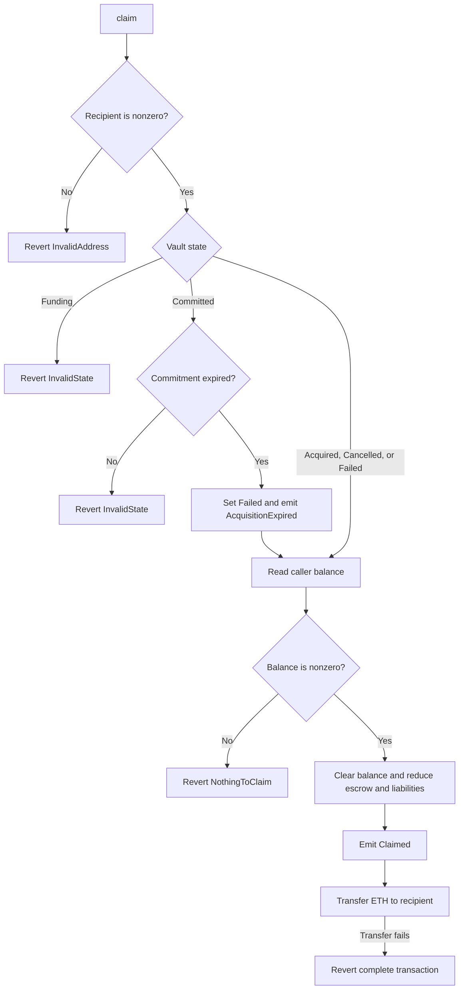

# ENS Diamonds Architecture

ENS Diamonds coordinates a fixed group that pools ETH to register one second-level `.eth` name to a deterministic Safe smart account.

Each vault fixes:

- the group members and Safe threshold;
- a maximum amount of ETH the group may escrow;
- one hidden ENS label and registration duration;
- one ENS commitment;
- one deterministic Safe address.

The group funds the vault, the creator locks funding and starts the ENS commitment window, and then anyone may execute the purchase. The Safe is deployed only when the name is about to be registered. ENS Diamonds never owns the ENS name.

The implementation is one immutable singleton. It has no administrator, upgrade path,
fees, protocol token, or discretionary ETH transfer.

## Actors and external systems

| Actor or system    | Responsibility                                                                                      |
| ------------------ | --------------------------------------------------------------------------------------------------- |
| Creator            | Defines the vault, is the first Safe owner, may cancel funding, and starts acquisition              |
| Member             | Is a fixed Safe owner; may deposit, withdraw during funding, and claim their refund                 |
| Executor           | Any address that calls permissionless purchase or expiry functions                                  |
| ENS Diamonds       | Holds escrow, validates commitments, deploys the Safe, registers the name, and accounts for refunds |
| ENS Controller     | Stores commitments, quotes rent, and registers the `.eth` name                                      |
| ENS Base Registrar | Reports the `.eth` NFT owner                                                                         |
| Safe Proxy Factory | Deploys the deterministic Safe proxy                                                                |
| Safe singleton     | Provides the Safe implementation used by every vault                                                |

## Trust and deployment assumptions

The constructor receives five immutable dependencies:

```solidity
IENSDiamondsRegistrarController controller
IBaseRegistrar baseRegistrar
ISafe safeSingleton
SafeProxyFactory safeProxyFactory
address safeFallbackHandler
```

The constructor rejects a zero address or an address without code. It does not prove that an address is the canonical deployment. Deployment tooling must provide the correct ENS and Safe addresses for the target chain.

The contract reads and caches:

- `minCommitmentAge`;
- `maxCommitmentAge`;
- `MIN_REGISTRATION_DURATION`;
- the Safe proxy initialization-code hash.

## State model

```solidity
enum State {
    Funding,
    Committed,
    Acquired,
    Cancelled,
    Failed
}
```



The terminal states are:

- `Acquired`: the intended Safe owns the name at acquisition finalization;
- `Cancelled`: the creator stopped the vault during funding;
- `Failed`: the single commitment window expired without a finalized acquisition.

Members claim independently while the vault remains in its terminal state.

## Storage model

### Vault

```solidity
struct Vault {
    address creator;
    uint96 escrowed;
    uint96 maxSpend;
    uint40 committedAt;
    uint32 registrationDuration;
    State state;
    bytes32 targetIntent;
    bytes32 ensCommitment;
}
```

| Field                  | Meaning                                                                 |
| ---------------------- | ----------------------------------------------------------------------- |
| `creator`              | Vault creator and first Safe owner, zero means the vault does not exist |
| `escrowed`             | ETH currently owed to this vault                                        |
| `maxSpend`             | Immutable cap on total funding and therefore ENS spending               |
| `committedAt`          | ENS commitment timestamp adopted or created by `beginAcquisition`       |
| `registrationDuration` | Requested ENS registration duration in seconds                          |
| `state`                | Current lifecycle state                                                 |
| `targetIntent`         | Salted protocol commitment to the hidden target label                   |
| `ensCommitment`        | Official ENS Controller commitment                                      |

The struct occupies four storage slots:

```text
slot 0: creator (160 bits) | escrowed (96 bits)
slot 1: maxSpend (96) | committedAt (40) | registrationDuration (32) | state (8)
slot 2: targetIntent
slot 3: ensCommitment
```

`uint96` safely covers any practical ETH amount. `uint40` covers timestamps for tens of thousands of years, and `uint32` covers registration durations of approximately 136 years.

### Other storage

```solidity
mapping(bytes32 vaultId => Vault vault) public vaults;
mapping(bytes32 vaultId => address[] owners) internal ownersOf;
mapping(bytes32 vaultId => mapping(address member => uint256 balance)) public balanceOf;
uint256 public totalLiabilities;
```

- `ownersOf` is fixed at creation and returned through `getOwners`.
- `balanceOf` is a contribution during funding and becomes a refundable balance after
  a normal purchase.
- `totalLiabilities` tracks all ETH owed across all vaults.

## Deterministic identities and commitments

### Vault ID

The client may predict the vault ID before creation:

```solidity
vaultId = keccak256(
    abi.encode(
        keccak256("ENS_DIAMONDS_VAULT_V1"),
        block.chainid,
        address(ensDiamonds),
        creator,
        vaultSalt
    )
);
```

The ID binds the vault to:

- the protocol version domain
- the chain
- the ENS Diamonds deployment
- the creator
- the creator's public uniqueness salt

The same creator cannot reuse the same `vaultSalt` in the same deployment because the
derived vault already exists.

### Label hash

For a normalized single label such as `diamond`:

```solidity
labelhash = keccak256(bytes("diamond"));
```

The Base Registrar token ID is `uint256(labelhash)`. A full ENS namehash is not needed.

### Target intent

The target intent commits to the hidden label without storing or emitting the label:

```solidity
targetIntent = keccak256(
    abi.encode(
        TARGET_INTENT_TYPEHASH,
        block.chainid,
        address(ensDiamonds),
        vaultId,
        creator,
        labelhash,
        registrationDuration,
        targetSalt
    )
);
```

The domain type is:

```text
ENSDiamondsTargetIntentV1(
    uint256 chainId,
    address protocol,
    bytes32 vaultId,
    address creator,
    bytes32 labelhash,
    uint32 registrationDuration,
    bytes32 targetSalt
)
```

`targetSalt` should be private and randomly generated. The contract does not attempt to measure entropy. it accepts any reveal that reconstructs the stored hash.

### ENS registration and commitment

The registration fixed by the protocol is:

```solidity
IETHRegistrarController.Registration({
    label: normalizedLabel,
    owner: predictedSafe,
    duration: registrationDuration,
    secret: ensSecret,
    resolver: address(0),
    data: new bytes[](0),
    reverseRecord: 0,
    referrer: bytes32(0)
});
```

Clients should obtain the commitment through the configured controller's `makeCommitment(registration)` function. The commitment binds every registration field, including the predicted Safe owner.

`ensSecret` should be independent from the label, vault salt, target salt, vault ID, and public timestamps.

### Safe address

The Safe threshold is:

```solidity
threshold = owners.length / 2 + 1;
```

| Owners | Threshold |
| -----: | --------: |
|      2 |         2 |
|      3 |         2 |
|      4 |         3 |
|      5 |         3 |
|      6 |         4 |
|      7 |         4 |
|      8 |         5 |
|      9 |         5 |
|     10 |         6 |

The salt nonce binds the Safe to the protocol, chain, deployment, and vault:

```solidity
saltNonce = uint256(
    keccak256(
        abi.encode(
            keccak256("ENS_DIAMONDS_SAFE_V1"),
            block.chainid,
            address(ensDiamonds),
            vaultId
        )
    )
);
```

The Safe initializer configures

- the fixed owners in their stored order
- the strict-majority threshold
- no setup delegatecall;
- the immutable compatibility fallback handler;
- no payment token, payment, module, or guard.

The Safe Factory CREATE2 formula binds the factory, singleton, initializer, and salt nonce. `predictSafe` and deployment use the same calculation.

## End-to-end user flow

The lifecycle is driven by the public state-changing functions. The creator creates the vault, members fund it, the creator begins the ENS commitment window, anyone may execute or expire the acquisition, and each contributor claims their own remaining ETH.



Cancellation and expiry are alternate exits:



Before calling `createVault`, the client must normalize the label according to ENSIP-15, choose the owner list, derive the deterministic Safe, generate independent `vaultSalt`, `targetSalt`, and `ensSecret` values, build `targetIntent`, and obtain the official ENS commitment for the exact registration. The public vault configuration includes `vaultSalt`, `targetIntent`, and `ensCommitment`; the normalized label, `targetSalt`, and `ensSecret` remain private until `purchase`.

## Create a vault

```solidity
function createVault(
    bytes32 vaultSalt,
    uint96 maxSpend,
    uint32 registrationDuration,
    address[] calldata owners,
    bytes32 targetIntent,
    bytes32 ensCommitment,
    string calldata vaultUri_
) external payable returns (bytes32 vaultId);
```

The caller becomes the creator and must be `owners[0]`. The transaction creates a deterministic vault in `Funding` state and may include the creator's first deposit as `msg.value`.



The call requires:

- nonzero `vaultSalt`, `maxSpend`, `targetIntent`, and `ensCommitment`, plus a nonempty `vaultUri_`
- `registrationDuration` at least the Controller minimum cached at deployment
- `msg.value` not greater than `maxSpend`
- 2 to 10 unique owners
- creator at index zero
- no zero address, Safe sentinel, ENS Diamonds address, or predicted Safe in the owner list
- a `vaultId` that has not already been created

If `msg.value` is nonzero, it becomes both `balanceOf[vaultId][creator]` and the initial `vault.escrowed`, and increases `totalLiabilities`. No Safe is deployed and no ENS commitment is created during this call.

The call emits:

```solidity
event VaultCreated(
    bytes32 indexed vaultId,
    address indexed creator,
    uint96 maxSpend,
    uint32 registrationDuration,
    address[] owners,
    bytes32 targetIntent,
    bytes32 ensCommitment,
    string vaultURI,
    uint256 creatorDeposit
);
```

`vaultURI(vaultId)` returns the immutable public metadata endpoint supplied at creation. Metadata
content is hosted offchain and is not trusted by the acquisition or accounting logic.

## Fund a vault

### `deposit`

```solidity
function deposit(bytes32 vaultId) external payable;
```

A fixed member may add ETH while the vault is in `Funding`.

The call requires a nonzero `msg.value`, membership in the stored owner list, and `vault.escrowed + msg.value <= maxSpend`. It increases the member balance, vault escrow, and global liabilities by the same amount.

```solidity
event Deposited(bytes32 indexed vaultId, address indexed member, uint256 amount);
```

### `withdraw`

```solidity
function withdraw(bytes32 vaultId, uint256 amount, address payable recipient) external;
```

A contributor may withdraw part or all of their own balance while the vault is in `Funding`. The recipient may be any nonzero address.

The call requires a nonzero amount not greater than `balanceOf[vaultId][msg.sender]`. The contract reduces the member balance, vault escrow, and global liabilities before transferring ETH. A failed transfer reverts the complete transaction and restores the accounting.

```solidity
event Withdrawn(
    bytes32 indexed vaultId,
    address indexed member,
    address indexed recipient,
    uint256 amount
);
```

Deposits and withdrawals are disabled as soon as the vault leaves `Funding`. `maxSpend` is a funding cap, not a target amount. The creator may begin acquisition with any positive escrow.

## Cancel a vault

```solidity
function cancel(bytes32 vaultId) external;
```

Only the creator may cancel, and only while the vault is in `Funding`. Cancellation changes the state to `Cancelled` without changing balances, escrow, or liabilities. Every contributor can then recover their full recorded balance through `claim`.

```solidity
event VaultCancelled(bytes32 indexed vaultId);
```

A cancelled vault cannot be funded, reopened, or used for acquisition. A new attempt requires a new vault.

## Begin acquisition

```solidity
function beginAcquisition(bytes32 vaultId) external;
```

Only the creator may call this function. The vault must be in `Funding` and must hold a nonzero amount of ETH.

The function changes the state to `Committed` before calling the ENS Controller. Any later revert rolls back that state change. It reads the timestamp currently stored for `vault.ensCommitment` and decides whether to create, adopt, or replace the commitment.



The three Controller cases are:

- no stored timestamp: create a new commitment and store the current block timestamp
- unexpired timestamp: adopt it, including any waiting time that has already passed
- fully expired timestamp: replace it with a new commitment and restart the waiting period

At exactly `timestamp + maxCommitmentAge`, the canonical Controller permits neither registration nor recommitment, so the function reverts with `CommitmentAtBoundary`. It can be retried after the boundary.

Adopting an existing commitment is safe because the commitment fixes the exact registration, including the deterministic Safe as owner. A third party can submit the same commitment, but cannot alter its registration data.



A normal purchase is valid at or after the minimum-age boundary and strictly before the maximum-age boundary. Expiry is valid at or after the maximum-age boundary.

The call emits the authoritative timestamp, predicted Safe, and threshold:

```solidity
event AcquisitionCommitted(
    bytes32 indexed vaultId,
    bytes32 ensCommitment,
    address indexed predictedSafe,
    uint256 committedAt,
    uint256 threshold
);
```

## Purchase the name

```solidity
function purchase(
    bytes32 vaultId,
    string calldata normalizedLabel,
    bytes32 targetSalt,
    bytes32 ensSecret
) external;
```

Anyone may call `purchase`; the caller only pays transaction gas. The function is nonpayable and uses the vault's escrow for a normal registration.

The reveal is validated in two independent steps:

1. `normalizedLabel` and `targetSalt` must reconstruct the stored `targetIntent`
2. the exact registration containing `normalizedLabel`, predicted Safe, duration, and `ensSecret` must reconstruct the stored `ensCommitment`

This proves that the reveal matches both the hidden protocol target and the official ENS registration fixed at creation.

After validating the reveal, the function reads the Controller timestamp for the stored commitment:



The stored timestamp identifies the exact commitment generation adopted by `beginAcquisition`. `purchase` accepts only an equal Controller timestamp. Zero can mean the commitment was consumed, and another nonmatching value can mean the hash was recommitted. ENS Diamonds does not infer ownership or acquisition success from either case.

### Normal purchase

The normal branch runs while the Controller still stores the same timestamp adopted by `beginAcquisition`.



The function:

- reverts with `CommitmentTooYoung(validAt)` before `committedAt + minCommitmentAge`
- reverts with `CommitmentExpired(expiresAt)` at or after `committedAt + maxCommitmentAge`
- quotes `base + premium` from the Controller
- reverts with `InsufficientFunding(price, escrowed)` when the quote exceeds escrow
- deploys the deterministic Safe only if it has no code
- registers the exact ENS request with the quoted price
- verifies that the Base Registrar reports the predicted Safe as owner
- replaces each contribution with its proportional share of unused ETH
- changes the state to `Acquired`

If the Safe already exists at the predicted address, deployment is skipped and the existing code is used. If Safe deployment, ENS registration, or final owner verification fails, the complete transaction reverts. This also rolls back a Safe deployed earlier in the same transaction.

The unused ETH is:

```text
surplus = funding - protocolPrice
memberRefund = floor(memberContribution * surplus / funding)
```

Integer division can leave rounding dust. The entire remainder is assigned to the last positive contributor in stored owner order so that member balances still sum exactly to `vault.escrowed`. Members who contributed zero receive zero.

The purchase decreases `totalLiabilities` by exactly the ENS price. The remaining escrow and member balances are claimable.

```solidity
event NameAcquired(
    bytes32 indexed vaultId,
    bytes32 indexed labelhash,
    address indexed safe,
    uint256 protocolPrice,
    uint256 refundableBalance
);
```

`protocolPrice` is the amount paid to ENS and `refundableBalance` is the unused escrow allocated among contributors.

### A different commitment buys the name

Another account may register the same label through a different commitment, either to the predicted Safe or to another owner. This does not consume the vault's commitment, so the Controller timestamp can still equal `committedAt` and `purchase` enters the normal branch. The Controller rejects registration because the name is unavailable. The complete transaction reverts, the vault remains `Committed`, and contributors can recover their ETH after the original commitment expires.

### The commitment timestamp changes

Any Controller timestamp other than the stored `committedAt` reverts with `CommitmentChanged`. The protocol intentionally does not query the Universal Resolver, NameWrapper, CCIP gateways, or another ownership source to decide whether an external transaction acquired the name. The vault remains `Committed` until the configured Controller maximum age passes, then it becomes `Failed` and every contribution is refundable.

## Expire an acquisition

```solidity
function expireAcquisition(bytes32 vaultId) external;
```

Anyone may call this function when a `Committed` vault reaches:

```text
expiresAt = committedAt + maxCommitmentAge
```

The call reverts with `CommitmentNotExpired(expiresAt)` before that time. At or after the boundary it changes the state to `Failed` and emits:

```solidity
event AcquisitionExpired(bytes32 indexed vaultId);
```

Expiry does not mean that another account acquired the name. It only means this vault's one acquisition window ended without successful finalization. The function does not change balances, escrow, or liabilities, so every remaining balance becomes claimable.

An available name can be attempted again only through a new vault with a new `vaultSalt`, `vaultId`, commitment, and deterministic Safe. A vault cannot return from `Failed` to `Funding`.

If an external transaction consumed the commitment or acquired the target name, ENS Diamonds does not finalize that result. The vault expires and refunds its contributors even when an external ownership system reports the predicted Safe as owner.

## Claim remaining ETH

```solidity
function claim(bytes32 vaultId, address payable recipient) external;
```

Each contributor claims their own complete recorded balance. The caller may direct the payment to any nonzero recipient but cannot claim another member's balance.



The amount depends on how the vault ended:

| Final state | Claimable amount |
| ----------- | ---------------- |
| `Acquired` after a normal purchase | Proportional share of unused escrow |
| `Cancelled` | Full remaining contribution |
| `Failed` | Full remaining contribution |

The first claim after commitment expiry can move the vault directly from `Committed` to `Failed`, so a separate `expireAcquisition` transaction is optional. Claims are independent; one recipient rejecting ETH does not block another member from claiming.

```solidity
event Claimed(
    bytes32 indexed vaultId,
    address indexed member,
    address indexed recipient,
    uint256 amount
);
```

## Read protocol state

Read functions support client preparation and indexing but are not lifecycle actions:

- `vaults(vaultId)` returns the packed vault fields
- `balanceOf(vaultId, member)` returns the member's current contribution or refund
- `totalLiabilities()` returns the ETH owed across all vaults
- `getOwners(vaultId)` returns the dynamic fixed owner list, which cannot be returned by the public vault mapping getter
- `predictSafe(creator, vaultSalt, owners)` returns the deterministic `vaultId`, Safe address, and threshold before creation

Clients should use emitted events for history and storage getters for current authoritative state.

## Accounting

For every vault:

```text
sum(balanceOf[vaultId][owner]) == vaults[vaultId].escrowed
```

Across all vaults:

```text
sum(vaults[vaultId].escrowed) == totalLiabilities
```

The accounting transitions are:

| Action | Member balances | Vault escrow | Global liabilities |
| ------ | --------------- | ------------ | ------------------ |
| Creator deposit in `createVault` | `+msg.value` | `+msg.value` | `+msg.value` |
| `deposit` | `+msg.value` | `+msg.value` | `+msg.value` |
| `withdraw` | `-amount` | `-amount` | `-amount` |
| Normal `purchase` | Replaced by surplus shares | Set to surplus | `-protocolPrice` |
| `cancel` or `expireAcquisition` | Unchanged | Unchanged | Unchanged |
| `claim` | Caller balance cleared | `-amount` | `-amount` |

The contract rejects direct ETH through `receive` and `fallback`. ETH forced into the contract, for example through `SELFDESTRUCT`, is not included in `totalLiabilities` and has no rescue path. The contract's actual ETH balance may therefore be greater than, but must not be less than, `totalLiabilities`.
